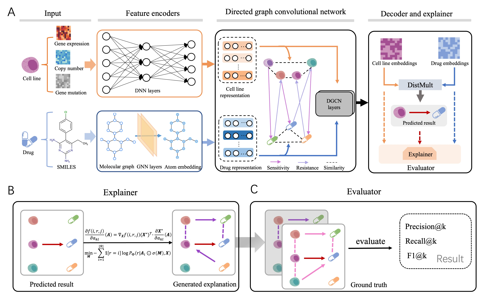

# DRExplainer
An official implement of Quantifiable Interpretability in Drug Response Prediction with Directed Graph Convolutional Network



## Environment Setup

To set up the required environment, you can choose from the following options:

- **Using conda**:
  You can install the necessary Python dependencies from the `environment.yml` file using the following command:

  ```bash
  conda env create -f environment.yml
  ```

## Contents

- **/prediction** - Contains all runnable code and data of prediction.

- **/explanation** - Contains all runnable code and data of explanation.

## Usage Guide

### 1. Prediction
  ```python
  python /prediction/code/DGCN.py
  ```

### 2. Explanation
  ```python
  python /explanation/DRExplainer.py
  ```

## Code

Here is a list of the code files in this repository:

- `generate_feature.py` - generates the feature of bio-entities and saves it to /prediction/data/node_representation.
- `generate_negedge.py` - generates the negative triples described in our paper and saves them to /prediction/data.
- `DGCN.py` - trains the prediction model and saves the model file to /prediction/data/weights.
- `dgcn_eval.py` - evaluates the model prediction performance in /prediction/data/weights.
- `ground_truth.py` - generates the ground truth benchmark dataset and save it to /explanation/data.
- `DRExplainer.py` - explaines the observable triples and save the results to  /explanation/data.
- `explain_eval.py` - evaluates the model interpretability performance is /explanation/data.


## Contact

If you need any help or are looking for cooperation feel free to contact us: haoyuanshi@stu.ahau.edu.cn.


